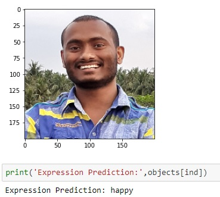

# Face-Emotion-Recognition

One test of this model is shown below:

fer2013 data is used here to make the model. The data is collected from Kaggle : https://www.kaggle.com/ahmedmoorsy/facial-expression/download

This data was firstly used in a Kaggle Challenege :https://www.kaggle.com/c/challenges-in-representation-learning-facial-expression-recognition-challenge/data/ , where the winner got 71.16% test accuracy 

Here in this model we got 65.5% test accuracy and 87% train accuracy

Using GPU in google colab the whole project is done.

